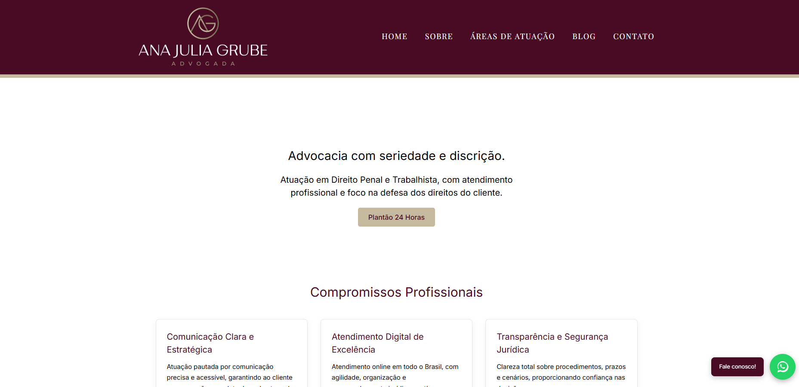

# 💼 Ana Julia Grube - Advocacia

Site institucional desenvolvido para escritório de advocacia, com foco em design moderno, responsividade e experiência do usuário.

🔗 Acesse o site: https://dra-ana-julia-grube-advocacia.vercel.app/

---

## 🧠 Aprendizados

- Responsividade mobile-first
- Controle de layout com Flexbox e Grid
- Integração com deploy automático (Vercel)

## 🚀 Tecnologias utilizadas

- Next.js
- React
- CSS (custom)
- Vercel (deploy)

---

## 📱 Responsividade

O site foi desenvolvido com foco em adaptação para diferentes dispositivos:

- Desktop
- Tablets
- Mobile (iPhone / Android)

---

## ✨ Funcionalidades

- Menu responsivo (mobile com menu lateral)
- Página institucional (Sobre)
- Cards interativos de contato
- Integração com WhatsApp
- Links para redes sociais
- Formulário de contato

---

## 📸 Preview

---

## 📌 Objetivo

Projeto desenvolvido para prática de desenvolvimento front-end e construção de portfólio profissional.

---